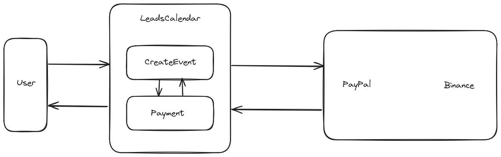

# Static View

When users create events on the interface, users are prompted to make payment of 1 USD or its equivalent in cryptocurrency. Once payment is successfully processed, events are confirmed.
